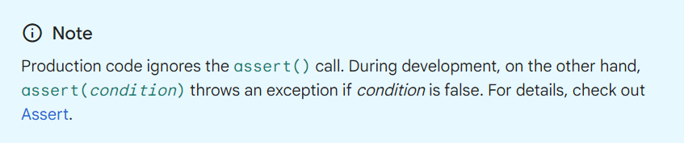

# Dart

```dart
void main(){

}
```

## Variable : 
```dart
//Variable :
int num1 = 9;
int num2 = 5;
print(num1+num2);

double nd1 = 3.14;
double nd2 = 4.5;
print(nd1+nd2);

String s1 = "Da";
String s2 = "rt";
print(s1+s2);

bool isAdult = true;
print(!isAdult);
```

### Dynamic , var : 
```dart
//Dynamic variable :not preferable, রানটাইমে ডিসিশান নেয় ভ্যালু দেখে।
  dynamic d;
  d = "Sohan";
  //d+=4;//Doesn't get error at compile time, but runtime...
  print(d);
  print(d.runtimeType);
  d = 33;
  print(d);
  print(d.runtimeType);

  //Var:
  var n1 = 42;//Preferable
 // n1 = "sh"; Got error at compile time
  print(n1);
  //All function is available as like int : But in dynamic it is absent....
  print(n1.isEven);

  var s = "Hridoy";
  print(s);
```

### var, final & const : 
```dart
//Var, Final , Const : 
var v1 = '10';
final v2 = '10';
const v3 = '10';

print(v1);
print(v2);
print(v3);

print("-----------");

v1 = '10001';
//v2 = '10001'; as final
//v3 = '10001'; as const

print(v1);
print(v2);
print(v3);

//Var is Mutable , it can be changed
//Final and const are immutable
```

### Final Vs Const :
```dart
//Final Vs Const : 

final df = DateTime.now();//final is a runtime constant;
//const dc = DateTime.now(); Gives error as DateTime.now() gives value at runtime...As const is a compile time constant so it doesn't work...

print(df);


final DateTime dff = DateTime.now();
final int ff = 3;//Also work but we don't write as dart automatically does this....
print(ff);
print(dff);
```

## String Basic : 
```dart
//String Basic : 
String str = "Sohan";
String str1 = '''Multiline
  String
    ...''';
print(str1);
//Escape Sequence : 
String str2 = "\$ printing this...";
print(str2);

//Printing var in string : 
print(str +' is great');//Not preferable ...
//Use String interpolation:
print('$str Good Morning!');
print('${str.runtimeType} is a string');
```


### Optional Variable : 
```dart
//Optional Variable : 
//Don't need to explicitly write null;
  //String? valS = null;
  String? valS;
  print(valS);
  //print(valS.length); compile time Error and this is null safety...

  //print(valS!.length); Got runtime error...

  //Checking and if null then print null or print length...
  print(valS?.length);
  valS = "Hello Boss!";
  print(valS?.length);
  print(valS.length);


  int? some2 = null;
  print(some2);

 // final? valF = null; not possible

  //If assign them null they will be dynamic and it's not preferable...
  final vf = null;
  const vc = null;
  var vr = null;
  print(vf.runtimeType);
  print(vc.runtimeType);
  print(vr.runtimeType);

```


```dart
String? someVal;
void main(){
  ////In main function dart compiler knows about the null value or not...But outside the main it can find so that's why we use optional var...
  print(someVal);
  someVal = "Dart";
  //print(someVal.length); is error as variable isn't in main
  print(someVal!.length);
  print(someVal?.length);

  //If null then I will show 0:
  someVal = null;
  print(someVal?.length??0);

  //print(someVal!.length??0);//Error...


  int a;
  //print(a);// Error: Dart doesn't set initial values to non-nullable types.

  int? aa;
  print(aa);
  /*
  Uninitialized variables that have a nullable type have an initial value of null. Even variables with numeric types are initially null, because numbers—like everything else in Dart—are objects.
  */
  //null
  //print(aa.isEven);//can't access properties or call methods on an expression with a nullable type.The same exception applies where it's a property or method that null supports like hashCode or toString().

  print(aa.toString());
  print(aa.toString().runtimeType);
}
```




### If-else:
```dart
bool isAdult = false;
void main(){

  //bool isAdult = false;
  //dead code as it is recognized as false....
  if(isAdult){
    print("Adult");
  }else{
    print("Child");
  }
}
```

### Ternary and Switch : 
```dart
String str = "Dart";
//Ternary:
 String checkS = str.startsWith('D') && str.endsWith('t') ? "It's Dart":"It's Flutter";

print(checkS);

//Switch:
switch(str){
  case 'Dart':
    print('It\'s Dart');
  case 'Flutter':
    print('It\'s Flutter');
  default:
    print('Java');
}

//Break lage nah...But jokhn ekta case e milbe kintu kisu kora lagbe nah then break use korbo...

// We can check other condition also : 
int age = 18;

switch(7){
  case 1:
    print('Hello');
  case 7 when age==18:
    break;
  default:
      print("Yooo");
}
```

### Exercise : 

```dart
/*
Develop a program to calculate the shipping cost based on the destination zone and the weight of the package(You will be provided)
Calculate the shipping cost according to these conditions:
If the destination zone is 'XYZ', the shipping cost is $5 per kilogram.
If the destination zone is 'ABC', the shipping cose is $7 per kilogram.
If the destination zone is 'PQR', the shipping cost is $10 per kilogram.
If the destination zone is not 'XYZ','ABC', or 'PQR', display an error message
*/
void main(){
  String destinationZone = 'XYZ';
  double weightInKgs = 6;
  double cost = 0;
  if(destinationZone=='XYZ'){
    cost = weightInKgs*5;
  }else if(destinationZone=='ABC'){
    cost = weightInKgs*7;
  }else if(destinationZone == 'PQR'){
    cost = weightInKgs*10;
  }else{
    print('Error!');
    return;
  }

  print('Shippping Cost: \$$cost');
}
```


